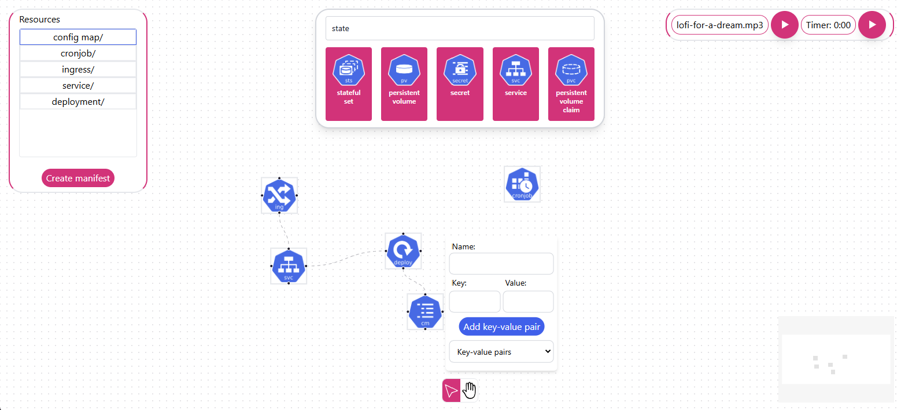

# Drawnetes

Drawnetes is a visual tool designed to facilitate the creation and management of Kubernetes resources. With an intuitive drag-and-drop interface and real-time display options, Drawnetes helps users visualize and manage Kubernetes components efficiently.



## Features

- Visual representation of various Kubernetes resources
- Drag-and-drop interface to add and connect components
- Tooltips and details for each Kubernetes resource type
- Audio features and custom toolbar icons for an enhanced experience

## Prerequisites

- [Node.js](https://nodejs.org/) (version 14 or higher)
- [npm](https://www.npmjs.com/) or [yarn](https://yarnpkg.com/)

## Getting Started

1. **Clone the Repository**

   ```bash
   git clone https://github.com/your-username/Drawnetes.git
   cd Drawnetes

2. **Install Dependencies**

   ```bash
   npm install
   ```
   
   or

   ```bash
   yarn install
   ```

3. **Run the Development Server**

   To start the development server, run:

   ```bash
   npm run dev
   ```

   or

   ```bash
   yarn dev
   ```

   The application should now be accessible at http://localhost:5173